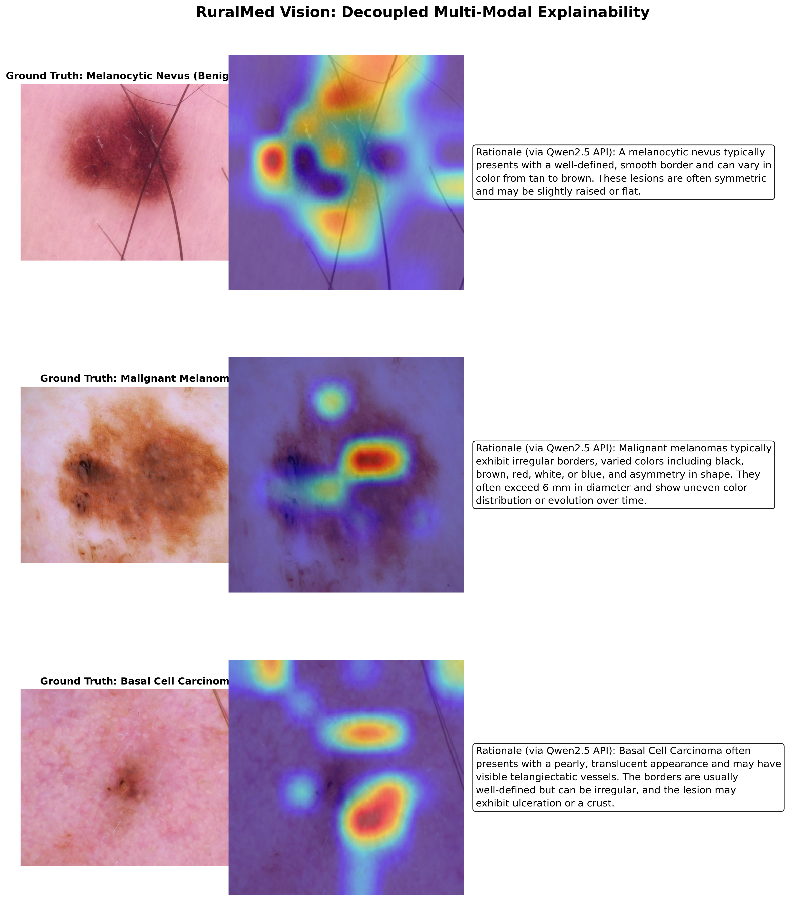

# RuralMed Vision

**Edge-Deployable Multimodal Triage for Resource-Constrained Clinical Settings**

[](https://python.org)
[](https://huggingface.co/Qwen/Qwen2.5-VL-7B-Instruct)
[](LICENSE)
[]()

---

## Overview

RuralMed Vision is a QLoRA fine-tuned vision-language model for **offline skin lesion severity triage**, built for community health workers and clinics without reliable internet access. It takes a skin lesion image and a free-text symptom description, and returns a structured triage classification:

```json
{
  "condition": "Melanocytic Nevus (Mole)",
  "severity": "LOW",
  "dx_code": "nv"
}
```

The fine-tuned model improves severity classification accuracy from **13.0% (zero-shot)** to **85.0%** on a held-out HAM10000 test set, and is quantized to a **4.36 GB GGUF artifact** that runs fully offline on an 8GB consumer GPU.

This is a research prototype, not a deployed clinical tool. Limitations are documented in detail below -- see [Known Limitations](#known-limitations).

---

## Results


*Decoupled explainability pipeline: occlusion saliency (faithful to the triage model) paired with a post-hoc rationale from a separate general-purpose model, conditioned on the ground-truth label.*

| Metric | Zero-Shot Baseline | RuralMed Vision (Fine-tuned) |
|---|---|---|
| Severity accuracy | 13.0% | **85.0%** |
<<<<<<< HEAD
| Cohen's Kappa | 0.014 | **0.608** |
| Matthews Correlation | 0.030 | **0.631** |
=======
| Cohen's Kappa | 0.020 | **0.611** |
| Matthews Correlation | 0.045 | **0.636** |
>>>>>>> 46850c23848c893467ba9870132fe972877cabfa
| Expected Calibration Error | -- | 0.430 (severe overconfidence) |

Evaluated on n=200 samples drawn from a 3,005-sample held-out test set (seed-disjoint from training). Full per-class breakdown and methodology in [`RuralMed_Evaluation.ipynb`](RuralMed_Evaluation.ipynb).

**Edge deployment:**

| Format | Size | Inference Speed |
|---|---|---|
| HF model (4-bit bitsandbytes) | ~6.0 GB VRAM | -- |
| GGUF Q4_K_M (offline, llama.cpp) | 4.36 GB | 49.1 tok/s on RTX 4060 |

---

## Architecture

```
Input: [Skin Lesion Image] + [Symptom Text]
                  |
       Qwen2.5-VL-7B-Instruct
       (vision encoder + language decoder)
                  |
        QLoRA Adapter (r=16, 4-bit NF4)
                  |
        Structured JSON Output
     (condition, severity, dx_code)
```

---

## Datasets

| Dataset | Size | Use |
|---|---|---|
| [HAM10000](https://www.kaggle.com/datasets/kmader/skin-lesion-analysis-toward-melanoma-detection) | 10,015 dermoscopy images | Visual triage training + held-out evaluation |
| [HealthCareMagic-100k](https://huggingface.co/datasets/lavita/ChatDoctor-HealthCareMagic-100k) | 100k clinical Q&A pairs (filtered subset) | Symptom-text context during fine-tuning |

---

## Training Setup

- **Model:** Qwen/Qwen2.5-VL-7B-Instruct
- **Method:** QLoRA (r=16, alpha=32, dropout=0.05, NF4 4-bit quantization, double quant)
- **Target modules:** q/k/v/o_proj, gate/up/down_proj
- **Hardware:** NVIDIA RTX 4060 Laptop (8GB VRAM)
- **Epochs:** 5 | **Train samples:** 2,000 | **Eval samples:** 200
- **Eval loss:** 0.04 | **Perplexity:** 1.04

---

## Known Limitations

This project intentionally reports negative findings alongside the headline result -- see [`paper/content.md`](paper/content.md) for the full writeup.

- **Diagnostic-level mode collapse.** While severity-tier accuracy is 85.0%, the underlying 7-class confusion matrix shows the model defaulting toward melanoma/nevi for ambiguous lesions; basal cell carcinoma and actinic keratosis are essentially unrepresented in the model's effective output distribution at n=200.
- **Severe confidence miscalibration.** ECE = 0.43 -- the model is consistently overconfident regardless of correctness. Calibration correction (temperature scaling, etc.) is future work.
- **MC Dropout uncertainty quantification is currently broken.** The dropout-toggling logic in `src/inference.py` enables dropout across all model modules indiscriminately, producing degenerate (zero-entropy) outputs across samples. Not used in any reported result.
- **Rationale generation is decoupled and post-hoc, not model-faithful.** The fine-tuned model's own language head degrades under joint training on structured classification + unstructured dialogue data. Textual rationales shown in the XAI figure are generated by a separate model (Qwen2.5-72B-Instruct via API) conditioned on the *ground-truth* label, not the triage model's actual reasoning. Only the occlusion saliency map is faithful to the deployed model.
- **Federated LoRA (FedAvg) aggregation** is implemented but not validated as part of this evaluation; treat as an unverified, exploratory direction rather than a completed contribution.
- **Evaluation is on n=200** of the 3,005-sample held-out set. Full-set evaluation would tighten confidence intervals but wasn't run due to compute time.

---

## Project Structure

```
ruralmedvision/
├── configs/
│   ├── config.example.yaml      # Template config -- copy to config.yaml and edit paths
│   └── config.yaml              # Your local config (gitignored)
├── src/
│   ├── data_prep.py             # HAM10000 + HealthCareMagic preprocessing
│   ├── train.py                 # QLoRA fine-tuning loop
│   ├── evaluate.py              # Metrics: accuracy, F1, confusion matrix
│   ├── inference.py             # Inference engine (MC Dropout UQ: known broken, see above)
│   └── quantize.py              # LoRA merge + GGUF export
├── merge_weights.py             # Step 1 of GGUF pipeline: sanitizes adapter_config.json
│                                 #   against installed PEFT version, merges adapter into base model
├── models/
│   └── ruralmed_adapter/        # LoRA adapter config + tokenizer (weights via Releases)
├── data/
│   └── HAM10000_metadata.csv    # Metadata only -- images downloaded separately, see Quickstart
├── RuralMed_Evaluation.ipynb    # Full evaluation pipeline (source of all reported metrics)
├── RuralMed_API_Grid.png        # Decoupled XAI figure
├── ablation_results.json        # Modality ablation (text-only vs multimodal)
├── baseline_results.json        # Zero-shot per-sample predictions
├── ft_results.json              # Fine-tuned per-sample predictions
├── metrics.json                 # Full metrics (accuracy, kappa, MCC, per-class P/R/F1)
├── requirements.txt
└── README.md
```

---

## Quickstart

### 1. Clone & install

```bash
git clone https://github.com/0x-NaN/ruralmedvision.git
cd ruralmedvision
python -m venv .venv
source .venv/bin/activate        # Windows: .venv\Scripts\activate
pip install -r requirements.txt
```

### 2. Configure

```bash
cp configs/config.example.yaml configs/config.yaml
# edit configs/config.yaml -- adjust data paths for your machine
```

### 3. Download datasets

Download [HAM10000](https://www.kaggle.com/datasets/kmader/skin-lesion-analysis-toward-melanoma-detection) and place under `data/`:

```
data/
├── HAM10000_metadata.csv
├── HAM10000_images_part_1/
└── HAM10000_images_part_2/
```

### 4. Get model weights

The LoRA adapter weights (~1GB) and quantized GGUF (4.36GB) are distributed via [GitHub Releases](../../releases) rather than committed to the repo. Download and place the adapter weights at `models/ruralmed_adapter/adapter_model.safetensors` (alongside the already-included config files).

### 5. Run training (optional -- to reproduce from scratch)

```bash
python src/train.py --config configs/config.yaml
```

### 6. Run evaluation

Open [`RuralMed_Evaluation.ipynb`](RuralMed_Evaluation.ipynb) for the full evaluation pipeline: zero-shot vs fine-tuned comparison, confusion matrix, calibration analysis, and the decoupled XAI pipeline.

### 7. Merge and quantize for offline deployment

```bash
# Step 1: merge LoRA adapter into base model (sanitizes adapter_config.json
# against your installed PEFT version, then merges to models/ruralmed_merged_fp16/)
python merge_weights.py

# Step 2: convert to GGUF and quantize to Q4_K_M
python src/quantize.py --config configs/config.yaml --benchmark
```

Requires [llama.cpp](https://github.com/ggml-org/llama.cpp) cloned separately for the GGUF conversion step (see `quantize.py` output for exact instructions). Note: `merge_weights.py` overwrites `adapter_config.json` in place to strip keys incompatible with your installed PEFT version — this is expected and idempotent.

---

## Roadmap

- [x] QLoRA fine-tuning on HAM10000 + HealthCareMagic
- [x] Held-out, seed-disjoint evaluation protocol
- [x] GGUF 4-bit quantization + llama.cpp offline deployment
- [x] Decoupled explainability pipeline (occlusion saliency + post-hoc rationale)
- [ ] Fix MC Dropout uncertainty quantification (currently broken -- see Known Limitations)
- [ ] Full 3,005-sample evaluation (currently n=200)
- [ ] Calibration correction (temperature scaling)
- [ ] Validate Federated LoRA (FedAvg) aggregation across simulated clinic nodes
- [ ] Resolve diagnostic-level mode collapse for minority classes (BCC, AKIEC)

---

## Citation

If you use this work, please cite:

```bibtex
@misc{ruralmedvision2026,
  title   = {RuralMed Vision: Edge-Deployable Multimodal Triage with a Decoupled
             Explainability Pipeline for Low-Resource Clinical Settings},
  author  = {Chatterjee, Asmit},
  year    = {2026},
  url     = {https://github.com/0x-NaN/ruralmedvision}
}
```

---

## Disclaimer

RuralMed Vision is a **research prototype** intended as a decision-support exploration for trained health workers, not a deployed or clinically validated diagnostic tool. It is **not a substitute for professional medical diagnosis**. All triage outputs should be reviewed by qualified personnel before any clinical action is taken. See [Known Limitations](#known-limitations) for the specific failure modes identified during evaluation.

---

## License

MIT License -- see [LICENSE](LICENSE) for details.
